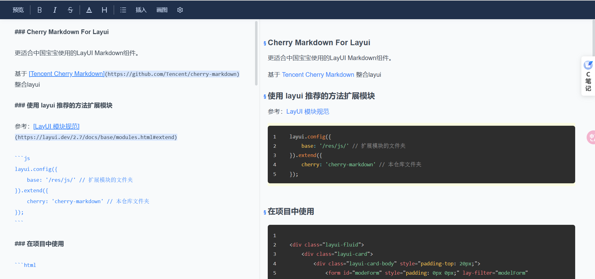

### Cherry Markdown For Layui

更适合中国宝宝使用的LayUI Markdown组件。

基于 [Tencent Cherry Markdown](https://github.com/Tencent/cherry-markdown) 整合layui



### 使用 layui 推荐的方法扩展模块

参考：[LayUI 模块规范](https://layui.dev/2.7/docs/base/modules.html#extend)

```js
layui.config({
    base: '/res/js/' // 扩展模块的文件夹
}).extend({
    cherry: 'cherry-markdown' // 本仓库文件夹
});
```

### 在项目中使用

```html

<div class="layui-fluid">
    <div class="layui-card">
        <div class="layui-card-body" style="padding-top: 20px;">
            <form id="modeForm" style="padding: 0px 0px;" lay-filter="modelForm" class="layui-form model-form">
                <div class="layui-form-item">
                    <div id="editor" style="height: 80vh"></div>
                </div>
                <div class="layui-form-item text-right" style="padding-bottom: 0px">
                    <button class="layui-btn layui-btn-primary" type="button" ew-event="closeDialog">取消</button>
                    <button class="layui-btn" lay-filter="modelSubmit" lay-submit>保存</button>
                </div>
            </form>
        </div>
    </div>
</div>
<script>
    layui.use(['layer', 'form', 'cherry'], function () {
        var $ = layui.jquery;
        var layer = layui.layer;
        var form = layui.form;
        var cherry = layui.cherry;

        // 初始化 markdown 编辑器
        cherry.init('editor');

        // 表单提交事件
        form.on('submit(modelSubmit)', function (obj) {
            console.log(cherry.html()); // 获取 markdown 中的 html
            console.log(cherry.md()); // 获取 markdown 内容
        });
    });
</script>
```

### API文档

| 方法                                                    | 说明                    | 参数                                                                                                                      |
|-------------------------------------------------------|-----------------------|-------------------------------------------------------------------------------------------------------------------------|
| init(element: str, isReadOnly: boolean = false): void | 初始化 markdown 编辑器      | <ul><li>element: 传入要放置编辑器的元素id，如果传入不存在的元素则会使用dom模式在页面最后生成一个</li><li>isReadOnly： 是否为只读模式(只读模式会隐藏toolbar，并且不可写入)</li><ul> |
| setContent(content: string): void                     | 设置编辑器的内容              | <ul><li>content：符合markdown规范的文本</li></ul>                                                                               |
| html(): void                                          | 获取编辑器内容，格式为html       |                                                                                                                         |
| fileUpload(file: obj, callback: function)             | 上传事件回调，请在``init``之前调用 | <ul><li>file：上传文件对象</li><li>callback: 回显markdown函数，具体参数请看下方``callback 对象示例``</li></ul>                                  |
| md(): void                                            | 获取编辑器内容，格式为markdown   |                                                                                                                         |
| image(): void                                         | 导出编辑器内容为图片格式          |                                                                                                                         |
| pdf(): void                                           | 导出编辑器内容为pdf格式(打印形式)   |                                                                                                                         |

##### callback 对象示例

```js
callback('文件url(必填)', {
    name: '',  // 显示的文件名
    poster: '',  // 视频封面
    isBorder: true,  // 边框
    isShadow: true,  // 阴影
    isRadius: true,  // 圆角
});
```

### 自己实现更多方法

之间在本仓库下 ``cherry.js`` 中扩展就可以了，在项目中直接使用cherry原始对象可以通过 ``cherry.obj ``

